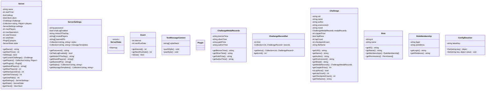

# Class Diagram

```mermaid
classDiagram

class Server {
    -string name
    -int startTime
    -bool debug
    -GbxClient client
    -Challenge challenge
    -Collection~string, Player~ players
    -ServerSettings settings
    -int maxPlayers
    -int maxSpectators
    -int voteTimeout
    -int voteRatio
    -Plugin[] plugins
    -ServerState state
    +getName() string
    +getStartTime() int
    +isDebug() bool
    +getCurrentChallenge() Challenge
    +getPlayers() Collection~string, Player~
    +getPlugins() Plugin[]
    +getMutedPlayers() string[]
    +getMaxPlayers() int
    +getMaxSpectators() int
    +getVoteTimeout() int
    +getVoteRatio() int
    #getSettings() ServerSettings
    #getState() ServerState
    #getClient() GbxClient
}

class ServerSettings {
    -string password
    -bool chatLogEnabled
    -string mottoOfTheDay
    -string[] mutedPlayers
    -string[] bannedIPs
    -Collection~string, string~ styles
    -Collection~string, string~ messageTemplates
    +getPassword() string
    +isChatLogEnabled() bool
    +getMottoOfTheDay() string
    +getMutedPlayers() string[]
    +getBannedIPs() string[]
    +getStyles() Collection~string, string~
    +getMessageTemplates() Collection~string, string~
}

class ServerState {
    <<enum>>
    +Warmup
}

class Event {
    -int interval
    -int nextRunDate
    +getInterval() int
    +getNextRunDate() int
    +isDue() bool
}

class TextMessageContext {
    -string[] styleStack
    +pushStyle() void
    +popStyle() void
}

class Plugin {
}

class ChallengeMedalRecords {
    -string bronzeTime
    -string silverTime
    -string goldTime
    -string authorTime
    +getBronzeTime() string
    +getSilverTime() string
    +getGoldTime() string
    +getAuthorTime() string
}

class ChallengeRecordSet {
    -int limit
    -Collection~int, ChallengeRecord~ records
    +getItems() Collection~int, ChallengeRecord~
    #getLimit() int
}

class Challenge {
    -string uid
    -string name
    -string author
    -string environment
    -string mood
    -ChallengeMedalRecords medalRecords
    -int copperPrice
    -bool lapRace
    -int lapCount
    -int checkpointCount
    -string fileName
    +getUID() string
    +getName() string
    +getAuthor() string
    +getEnvironment() string
    +getMood() string
    +getMedalRecords() ChallengeMedalRecords
    +getCopperPrice() int
    +isLapRace() bool
    +getLapCount() int
    +getCheckpointCount() int
    +getFileName() string
}

class Role {
    -string id
    -string name
    +getID() string
    +getName() string
    +getMemberships() RoleMembership[]
    +getPermissions() Permission[]
}

class RoleMembership {
    -string login
    -string ipAddress
    +getLogin() string
    +getIPAddress() string
}

class ConfigResolver {
    -string baseKey
    +Get(string key) object
    +Set(string key, object value) void
}
```
